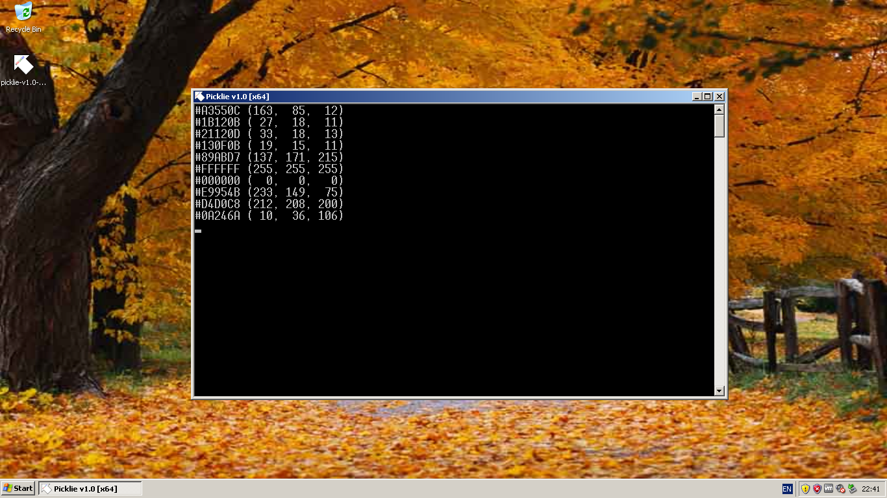

# Picklie

#### [English](README.md) &bull; [Русский](README-RU.md)

 

**Picklie** is a tiny and minimalistic color picker for Windows.

## Usage

[Download the latest release](https://github.com/ivan-movchan/picklie/releases/latest) and run the executable file matching your system architecture (32-bit or 64-bit).

### Command line

`picklie.exe [-v | --version]`

- `-v` (`--version`): show program version and exit.

### Keys

- <kbd>Enter</kbd>: pick a color under the cursor pointer. The console window must be focused when picking.
- <kbd>Escape</kbd>: exit.

> [!TIP]
> You can copy a color code by selecting it in console (or clicking it twice) and pressing <kbd>Enter</kbd>.

## Development

MinGW (GCC + GNU make) is required for building the program. [Clone this repository](https://github.com/ivan-movchan/picklie.git) and run `make` command in the folder.

## Version history

See [CHANGELOG.md](CHANGELOG.md) file.

## Contributing

Any feedback and contributions are welcome. Report bugs and suggest new ideas using ["Issues"](https://github.com/ivan-movchan/picklie/issues) page or by contacting the developer privately. You are free to fork the repository, improve the project and send a pull request.

Before reporting the problem, update to the latest version: your problem may have been already resolved.

## Authors

- Idea and development: [Ivan Movchan](https://github.com/ivan-movchan).

## License

[MIT License](LICENSE)